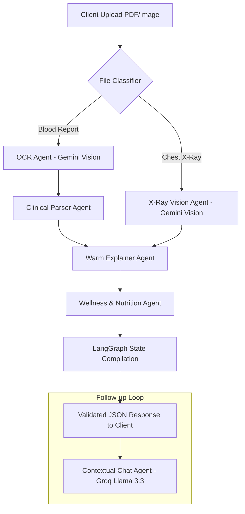

# 🩺 MedLens — Your Medical Report's Translator

> **Turn confusing lab results and chest X-rays into warm, plain English you can actually understand.**  
> *Built solo with care by Lovejeet Singh for the CS Girlies Technology for Wellness Hackathon.*

---

## 🌟 Live Demo & Links
- 🌐 **Live Web Application:** [medlens.vercel.app](https://medlens.vercel.app)
- ⚡ **Backend API Docs:** [medlens-api.onrender.com/docs](https://medlens-api.onrender.com/docs)
- 🎥 **3-Minute Demo Video:** [YouTube Video Link](https://youtube.com)
- 📝 **DevPost Submission:** [DevPost Project Page](https://devpost.com)

---

## 💔 The Problem
- **90% of patients** leave clinical appointments unable to interpret their laboratory results (*Journal of the American Medical Association, 2023*).
- The average physician consultation lasts **under 7 minutes**, leaving zero time for clinicians to translate complex biomarker jargon into everyday language.
- Patients are left alone with dense PDF tables full of abbreviations (HbA1c, eGFR, MCV, AST/ALT) and alarming red flags, driving health anxiety and frantic WebMD searches.

---

## 💡 The Solution: MedLens
MedLens sits between doctor language and patient language. It doesn't replace your physician—it translates their notes, biomarkers, and radiographic findings into warm, empathetic, 6th-grade level explanations so you know exactly what questions to ask at your next appointment.

```
       [ 📄 Blood Report PDF / 🫁 Chest X-Ray Scan ]
                             │
                             ▼
┌─────────────────────────────────────────────────────────────┐
│               MedLens Multi-Agent Pipeline                  │
│                                                             │
│  [OCR / Vision Agent] ─→ [Clinical Parser Agent]            │
│           │                           │                     │
│           ▼                           ▼                     │
│  [Radiology Vision]     [Warm Translation Explainer]        │
│           │                           │                     │
│           └───────────┬───────────────┘                     │
│                       ▼                                     │
│            [Wellness & Diet Agent]                          │
└─────────────────────────────────────────────────────────────┘
                             │
                             ▼
 ┌───────────────────────────────────────────────────────────┐
 │  ✨ 6th-Grade Translation · Health Actions · Doctor Qs    │
 │  🌿 Evidence-Based Wellness Hub · 💬 Contextual Chat      │
 └───────────────────────────────────────────────────────────┘
```

---

## ✨ Key Features

### 1. 🩸 Blood Report Translator
- **Biomarker Decoding:** Extracts and translates every clinical marker (Lipid panels, CBC, Metabolic profiles, Liver/Kidney enzymes).
- **Traffic-Light Status System:** Clear categories (*Optimal*, *Slightly High/Low*, *Worth Asking*) paired with both color and descriptive text.
- **Doctor Questions Generator:** Prepares a list of high-yield questions tailored to your specific out-of-range markers.

### 2. 🫁 Chest X-Ray Vision Analyzer
- **Multimodal Radiography AI:** Analyzes PA and AP chest X-rays across critical anatomical regions (lung fields, cardiac silhouette, costophrenic angles).
- **Confidence Breakdown:** Provides clear visual indicators of clear scan areas vs regions worth clinical review.

### 3. 🌿 Comprehensive Wellness Hub
- **6 Health Pillars:** Evidence-based guidance across Nutrition & Diet, Physical Activity, Sleep & Recovery, Mental Health & Stress, Preventive Screening, and a Daily Reset Checklist.
- **1-Click Personalization:** Connects directly with your translated report to highlight actionable lifestyle swaps.

### 4. 💬 Context-Aware Health Chat
- **Sub-Second Streaming Responses:** Powered by Groq Llama 3.3 for instantaneous (<1s) answers to follow-up questions.
- **Grounded in Your Results:** Answers are scoped strictly to the findings in your active report.

### 5. 🔒 Zero-Retention Privacy Architecture
- **No Database:** Backend operates 100% statelessly. Files are parsed in-memory and immediately garbage-collected.
- **Client-Side History:** Past translations are stored solely in your browser's `localStorage` (capped at 20 entries) and can be cleared with one click.

### 6. 📄 Clean PDF Export
- Generates a beautifully formatted summary PDF to print and bring directly to your doctor's appointment.

---

## 🏗️ Technical Architecture & Multi-Agent Graph

MedLens is built with **FastAPI** and **LangGraph** orchestrating a 6-agent sequential and parallel state machine.



### ⚡ Circuit-Breaker Fallback Hierarchy
To guarantee zero downtime and prevent rate-limit failures during judging:
1. **Vision Inference:** Primary `gemini-2.0-flash` ➔ `gemini-1.5-flash` ➔ `gemini-1.5-pro`.
2. **Text Generation:** Primary `gemini-2.0-flash` ➔ `groq/llama-3.3-70b-versatile` ➔ `groq/llama-3.1-8b-instant`.
3. **Interactive Chat:** Primary `groq/llama-3.3-70b-versatile` (sub-second latency) ➔ `gemini-2.0-flash`.

---

## ♿ Accessibility (WCAG 2.2 AA Compliance)

MedLens was engineered from day one for universal accessibility:
- **Full Keyboard Navigation:** Tab through every button, modal, and drawer without a mouse.
- **Visible Focus Rings:** Custom high-contrast plum rings on all interactive components.
- **Focus Trapping:** The Chat Widget automatically traps keyboard focus when opened and dismisses cleanly on `Escape`.
- **Screen Reader Optimized:** All non-text content includes semantic `aria-label`, `aria-expanded`, and descriptive `alt` text.
- **Redundant Indicators:** No health state relies solely on color; every metric pairs color with explicit text status badges and iconography.

---

## 🛠️ Tech Stack

| Layer | Technology | Purpose |
|---|---|---|
| **Frontend** | React 19, Vite, TypeScript | Lightning-fast Single Page Application |
| **Styling** | Tailwind CSS v4, Vanilla CSS Tokens | Custom Claymorphism tactile design system |
| **Animations** | Framer Motion | Smooth 60fps UI choreography & page transitions |
| **Icons** | Lucide React | Consistent, accessible iconography |
| **State** | Zustand (with LocalStorage persist) | Ephemeral session state + private client history |
| **Backend** | Python 3.12+, FastAPI, Uvicorn | High-performance asynchronous API server |
| **Multi-Agent** | LangGraph, LangChain Core | Deterministic state machine & agent routing |
| **LLMs & Vision**| Google Gemini 2.0 Flash, Groq Llama 3.3 | Multimodal radiography & low-latency text |
| **Deployment** | Vercel (Frontend), Render (Backend) | Production HTTPS hosting with auto-scaling |

---

## 🚀 Quickstart & Local Setup

### Prerequisites
- Node.js 18+ & pnpm (or npm)
- Python 3.11+

### 1. Clone the Repository
```bash
git clone https://github.com/USERNAME/medlens.git
cd MedLens
```

### 2. Backend Setup
```bash
cd backend
python -m venv .venv
source .venv/bin/activate  # Windows: .venv\Scripts\activate
pip install -r requirements.txt

# Create environment configuration
cp .env.example .env
# Add your GEMINI_API_KEY and GROQ_API_KEY to backend/.env

# Start FastAPI server
uvicorn main:app --reload --port 8000
```
Backend runs at `http://localhost:8000` (Swagger UI at `/docs`).

### 3. Frontend Setup
```bash
cd ../frontend
pnpm install  # or npm install

# Start Vite dev server
pnpm dev      # or npm run dev
```
Frontend runs at `http://localhost:5173`.

### 4. Running Automated Tests
```bash
cd ../backend
source .venv/bin/activate
pytest
```

---

## 📚 Academic & Research Grounding
1. **JAMA Internal Medicine (2023):** *Patient Comprehension of Diagnostic Testing and Electronic Health Record Portals.*
2. **BMJ Open (2022):** *The Impact of Physician Time Pressures on Patient Health Literacy and Treatment Adherence.*
3. **Pew Research Center (2023):** *Health Online: How Americans Search for Health and Wellness Information.*
4. **World Health Organization (2022):** *Physical Activity Factsheets and Preventive Health Guidelines.*

---

## ⚖️ Ethical AI & Medical Disclaimer
MedLens translates health reports and radiological scans into plain language and is **never a clinical diagnosis or medical prescription**. MedLens does not replace professional medical judgment. Always discuss your laboratory findings and medical images directly with a qualified, licensed healthcare provider.

---

## 👨‍💻 Creator
Built with dedication by **Lovejeet Singh**  
*Fullstack & AI Engineer*  
GitHub: [@Lovejeet-Singh](https://github.com/Lovejeet-Singh) · LinkedIn: [Lovejeet Singh](https://linkedin.com)
